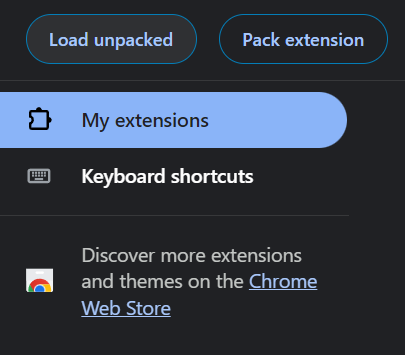

# clear-cut
A chrome extension to hide YouTube controls

## Installation
1. Download the extension from github using the green `Code` button and selecting `Download ZIP`

2. Unzip the downloaded file
3. Open Chrome and navigate to [chrome://extensions/](chrome://extensions/)
4. Enable `Developer mode` in the top right corner

5. Click `Load unpacked` in the top left corner

6. Select the unzipped folder

## Usage
1. Navigate to YouTube
2. Press `Ctrl + m` to hide the controls